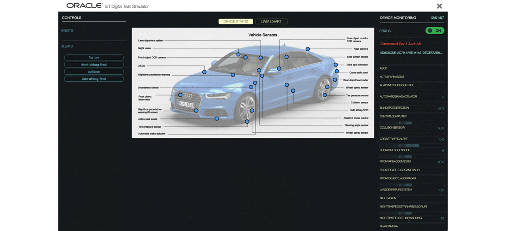
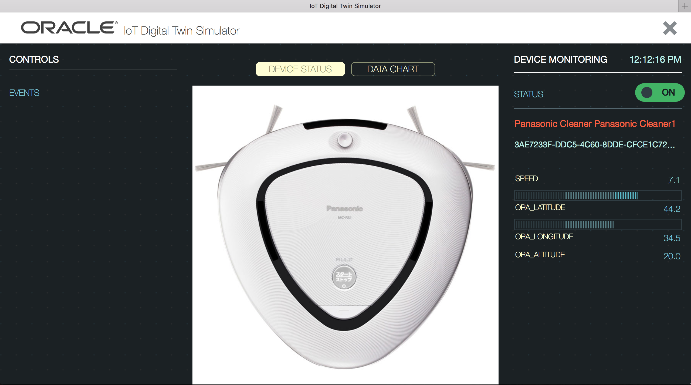

# PlugFest Preparation for Bundang F2F 2018

# 1. Introduction
 
This document describes general information related to the next plugfest in Bundang F2F meeting. 
The rest of this section shows the results of the last plugfest held in Prague on March 24-25.

## 1.1 Last plugfest

The following figure is the result of the Prague plugfest.

## 1.2 Participants and Servients

The following is a list of the participants and servients described in the "preparation.md" of the Prague plugfest.

<table>
  <tr>
    <th>Participants</th>
    <th>Application</th>
    <th>=protocol=</th>
    <th>Remote proxy</th>
    <th>=protocol=</th>
    <th>Local proxy</th>
    <th>=protocol=</th>
    <th>Device</th>
  </tr>
  <tr>
    <th rowspan="3">Intel</th>
    <td>OCF Smart Home</td>
    <td>HTTPS</td>
    <td rowspan="3">Digital Ocean and AWS</td>
    <td">SSH Tunnel + Remote Proxy</td>
    <td>IoT REST API Server</td>
    <td>CoAP</td>
    <td>Button, Light, RGB LED, Buzzer, Temperature, Illuminance, Motion</td>
  </tr>
  <tr>
    <td>Web Camera</td>
    <td>HTTPS</td>
    <td">SSH Tunnel + Remote Port Forwarding</td>
    <td>Direct via tunnel</td>
    <td>HTTPS</td>
    <td>Camera</td>
  </tr>
  <tr>
    <td>Web Speech</td>
    <td>HTTPS</td>
    <td">SSH Tunnel + Remote Port Forwarding</td>
    <td>Direct via tunnel</td>
    <td>HTTPS</td>
    <td>Speaker</td>
  </tr>
  <tr>
    <th rowspan="2">Fujitsu</th>
    <td>NodeRED</td>
    <td>HTTP(s)</td>
    <td rowspan="2">Fujitsu Cloud</td>
    <td rowspan="2">HTTP(s)+WS</td>
    <td>Local gateway</td>
    <td>HTTP</td>
    <td>Air conditioner, LED light, Blind</td>
  </tr>
  <tr>
    <td>Scripting App.</td>
    <td>HTTP</td>
    <td>Local gateway</td>
    <td>HTTP</td>
    <td>Sensors(Luminance sensor, Humidity sensor, Temperature sensor, Accelerometer), Rotating Light</td>
  </tr>
  <tr>
    <th rowspan="2">Panasonic</th>
    <td>NodeRED</td>
    <td rowspan="2"></td>
    <td rowspan="2"></td>
    <td rowspan="2"></td>
    <td rowspan="2"></td>
    <td>HTTP</td>
    <td>WoT Simulator, Google Home mini</td>
  </tr>
  <tr>
    <td>Scripting App.</td>
    <td>HTTPS(+WSS)</td>
    <td>LED light, Air conditioner (home/car), Robot Cleaner, Amazon Echo Dot, Google Home mini</td>
  </tr>
  <tr>
    <th>Internet Research Institute</th>
    <td>NodeRED</td>
    <td>HTTP(s)</td>
    <td></td>
    <td></td>
    <td></td>
    <td></td>
    <td></td>
  </tr>
  <tr>
    <th rowspan="2">Siemens</th>
    <td>Scripting App.</td>
    <td>HTTP, CoAP, BACnet, Modbus</td>
    <td rowspan="2">WoS Messaging Service</td>
    <td rowspan="2">(tunnel)</td>
    <td rowspan="2">WoS Messaging Service, TD Registration Agent</td>
    <td rowspan="2">HTTP</td>
    <td rowspan="2">Remote Festo Plant (valve, pump, levelmeter), BACnet Demonstrator, Logo! Demonstrator, RGB LED Light</td>
  </tr>
  <tr>
    <td>WebUI</td>
    <td>HTTP, CoAP</td>
  </tr>
  <tr>
    <th rowspan="2">Intel</th>
    <td>AWS WoT Skill</td>
    <td rowspan="2">HTTPS</td>
    <td rowspan="2">Cloud proxy shadow</td>
    <td rowspan="2">HTTPS/CoAP(s)</td>
    <td rowspan="2">Local Proxy</td>
    <td rowspan="2">CoAP</td>
    <td rowspan="2">OCF RGB light, OCF Light, OCF Buzzer, OCF temperture, OCF Button, OCF Proximity, OCF Slider, Still camera</td>
  </tr>
  <tr>
    <td>AlexNet Recog Service</td>
  </tr>
  <tr>
    <th rowspan="2">SmartThings</th>
    <td>NodeRED Local</td>
    <td rowspan="2">HTTP</td>
    <td rowspan="2">Remote gateway</td>
    <td rowspan="2">HTTP+MQTT</td>
    <td rowspan="2">Local gateway</td>
    <td rowspan="2">HTTP+MQTT</td>
    <td rowspan="2">Dimmable Light(ST), Motion Sensor(IPSO), Loudness Sensor(IPSO), Illuminance Sensor(IPSO)</td>
  </tr>
  <tr>
    <td>NodeRED Remote</td>
  </tr>
  <tr>
    <th>EURECOM</th>
    <td></td>
    <td></td>
    <td></td>
    <td></td>
    <td></td>
    <td>HTTP</td>
    <td>Sensors and Actuators in the car(BMW X5)</td>
  </tr>                
</table>

# 2. Next plugfest

This section describes the Bundang plugfest held on June 30 and July 1.

## 2.1 Participants and Servients

Each participant is expected to fill in the following table to share between them.

<table>
  <tr>
    <th>Participants</th>
    <th>Appliation</th>
    <th>=protocol=</th>
    <th>Remote proxy</th>
    <th>=protocol=</th>
    <th>Local proxy</th>
    <th>=protocol=</th>
    <th>Device</th>
  </tr>
  <tr>
    <th rowspan="2">Fujitsu</th>
    <td>NodeRED</td>
    <td>HTTP(s)</td>
    <td rowspan="2">Fujitsu Cloud</td>
    <td rowspan="2">HTTP(s)+WS</td>
    <td>Local gateway</td>
    <td>HTTP</td>
    <td>Air conditioner, LED light, Blind</td>
  </tr>
  <tr>
    <td>Scripting App.</td>
    <td>HTTP</td>
    <td>Local gateway</td>
    <td>HTTP</td>
    <td>Sensors(Luminance sensor, Humidity sensor, Temperature sensor, Accelerometer), Rotating Light</td>
  </tr>
  <tr>
    <td>Oracle</td>
    <td>IOT Cloud Service</td>
    <td>REST/HTTP(s)</td>
    <td>N/A</td>
    <td>REST/HTTP(s)</td>
    <td>Accessible via node-WoT + Oracle binding</td>
    <td>REST/HTTP(s)</td>
    <td>Cloud Service Management Console</td>
  </tr>
  <tr>
    <td>Oracle</td>
    <td>Digital Twin Simulator</td>
    <td>REST/HTTP(s)</td>
    <td>N/A</td>
    <td>REST/HTTP(s)</td>
    <td>Accessible via node-WoT + Oracle binding</td>
    <td>REST/HTTP(s)</td>
    <td>Festo Simulator, Connected Car, HVAC, BMW_X5, on-demand simulations for Plugfest participants' devices</td>
  </tr>
  <tr>
    <th>company or university</th>
    <td></td>
    <td></td>
    <td></td>
    <td></td>
    <td></td>
    <td></td>
    <td></td>
  </tr>
  <tr>
    <th>company or university</th>
    <td></td>
    <td></td>
    <td></td>
    <td></td>
    <td></td>
    <td></td>
    <td></td>
  </tr>
</table>

## 2.2 Checking points for the next plugfest

These were described in result.md in the Prague plugfest.

### (1) Connect with remote/local proxy

### (2) Application servients

### (3) Connect with node-wot

The Oracle IoT Cloud Service and the devices in the Digital Twin Simulator are accessible via a node-WoT instance
which includes an Oracle binding. 
This binding provides the integration between the IoT Cloud Service Product and the node-WoT reference implementation.

### (4) Scripting API

### (5) Thing Directory operation

### (6) Device Servients

### (7) Device simulators

#### Oracle Digital Twin Simulator
Oracle provides a Digital Twin Simulator for W3C WoT members, which is part of the Oracle IoT Cloud Service product.
This is a flexible simulation environment, which hosts multiple instances of various devices and a
simulation engine that allows the functional definition of a simulated device from a Web user interface.
It allows to build new device simulations with very small effort.

These device simulations are exposed via node-WoT and behave just like regular node-WoT devices.

The simulator can serve for:
* visualizing a device from a TD in a Web UI
* testing interoperability with node-WoT based devices
* defining a new device and generating a TD
* generating device data based on a functional simulation model

#### Simulated devices
Oracle provides "out of the box" device simulators for a variety of devices that are managed by the Digital Twin Simulator.
These are hosted in the Oracle IoT Cloud and are accessible via a node-WoT instance via an Oracle binding. 
The initial set of devices are a simulated Festo plant (Siemens), a Connected Car, HVAC, Blue Pump and several 
simulated devices that were built from the TDs from the Prague Plug Fest. 

##### Festo Simulator

##### Connected Car

##### HVAC

##### Fujitsu

##### Panasonic

#### Additional Device Simulations - TD import
Additional Device simulations can be easily defined by importing a device description in the 
Oracle Device Model format into the simulator.
The Device Model can be automatically generated from a Thing Description using the td2dm converter. 
This td2dm converter is provided in the "oracle-tools" folder.

#### Generating Thing Descriptions 
Alternatively, a device model for a new device can be easily created in the Oracle IoT Cloud Service using the management console.
This device model can be exported and the corresponding Thing Description can be automatically generated using the dm2td converter.
The dm2td converter is provided in the "oracle-tools" folder.

Oracle offers to assist other Plugfest participants to create simulated devices on demand.
If you are interested, please contact Michael.Lagally@oracle.com - preferably already before the plug fest.

### (8) Semantic integration

### (9) Security

### (10) Accessibility

### (11) Event handling

## 2.3 Other issues

The following points are picked up from Koster-san's material.

### (1) Validate the simplified TD

### (2) Extended Actions

### (3) Notification - websockets, webhooks

### (4) Discovery using Feature of Interest annotation

### (5) Application Scenarios, recipes

### (6) Proxy integration with Thing Directory

### (7) New security patterns

### (8) Test Framework

### (9) Other

## 2.3 Use cases

Please make orchestration use cases using WoT.

# 3 Schedule

Sat 30.6.18:  9:00-18:00  
Sun 1.7.18:  9:00-18:00  

Venue: TTA

# 4 Requirements for PlugFest Setting

| Participant | Number of Participants | Number of Power outlets | Network | Remarks |
|-------------|------------------------|-------------------------|---------|---------|
| Panasonic   | 3                      | 2                       | Wi-Fi(b/g/n), Ports: 22, 80, 443, 1880, 8001, 8003, 8091 | |
| Fujitsu     | 4                      | 2                       | Wi-Fi   |         |
| IRI         |                        |                         | Wi-Fi   |         |
| Siemens     | 4+(1)                  | 2                       | Wi-Fi   |         |
| Intel       | 1                      | 1                       | Wi-Fi and/or wired Ethernet | External ports: 22, 80, 443. Will bring own router and power bar.   |
| SmartThings | 1                      | 1                       | Wired   | 4sq ft table space |
| EURECOM     | 2                      | 2                       | Wi-Fi   |         |
| Oracle      | 1                      | 1                       | Wi-Fi   |         |
| Hitachi     | 1                      | 1                       | Wi-Fi(Ports: 443/tcp,443/udp(optional))   | use for note PC to access corporate servers via VPN. |
| Paciello    | 1                      | 1                       | Wi-Fi   |Will only need power outlet for laptop. Won't be bringing additional equipment.|
| Others      |                        |                         | Wi-Fi   |         |

# 5 Implementation guidelines

* "name" field of Thing Description shall be unique among the things which will be registered to Fujitsu Proxy.  
  Recommended convention is 'Company name'+'Thing name'  
  e.g.) "name": "PanasonicAirConditionerP1"
