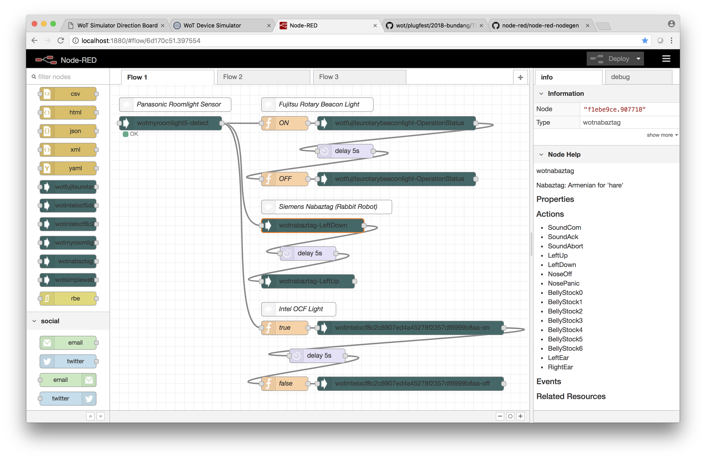
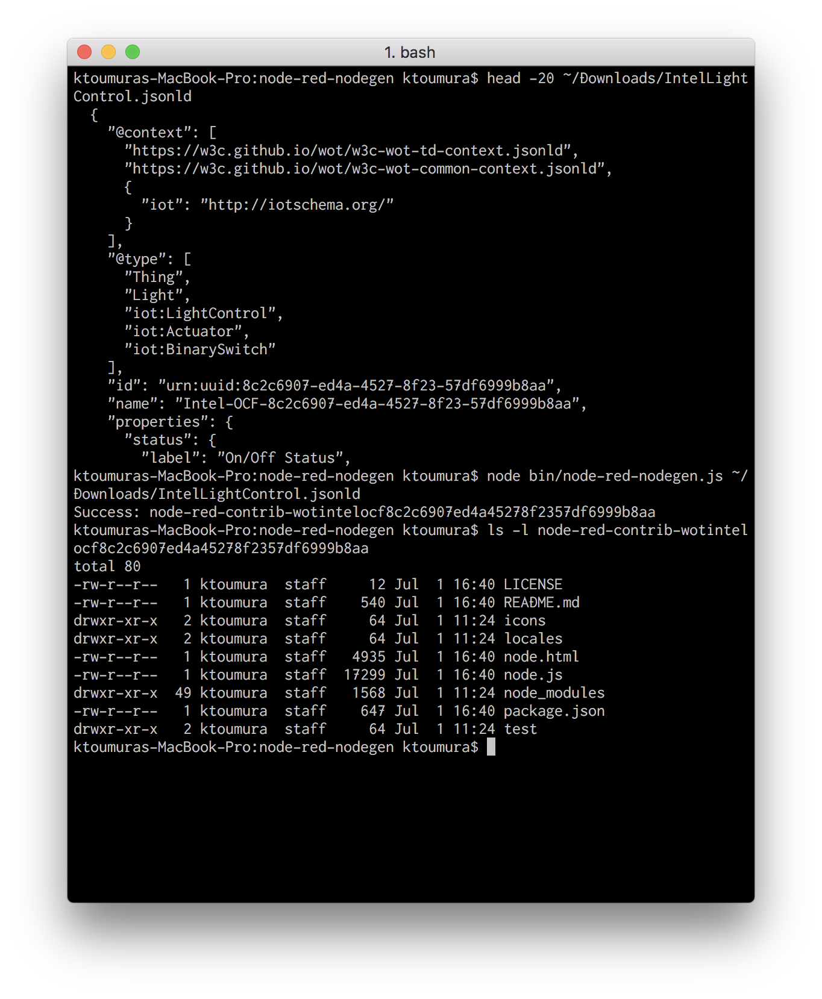
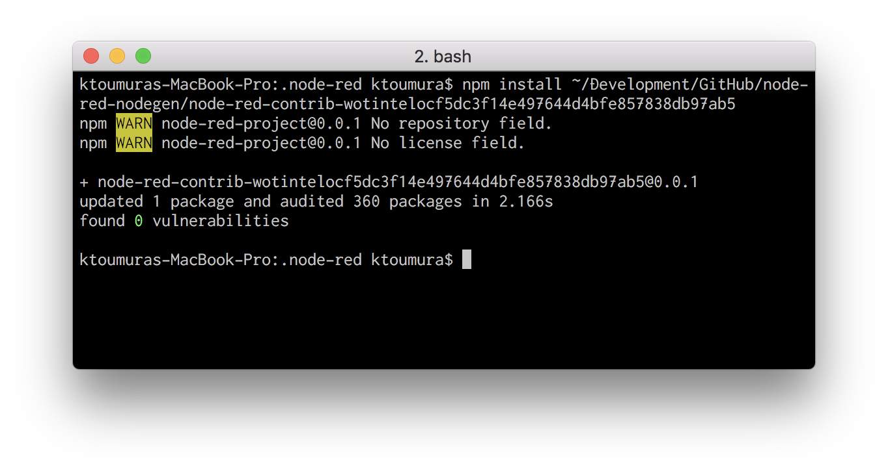
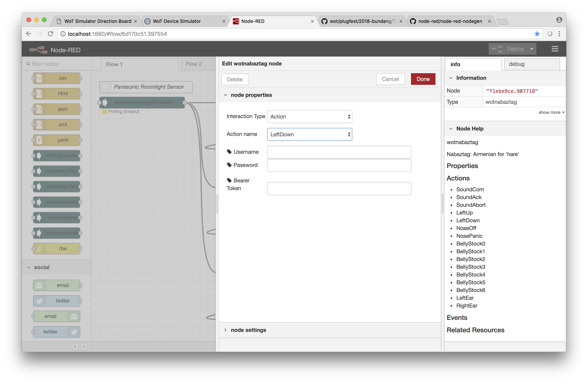

# PlugFest Result for Bundang 2018 (Hitachi)

## 3 Checking points for 2018 Bundang plugfest

### 3.1 Testing Individually

#### 3.1.1 Validate Simplified TDs -- was Other Issues (1)

* Hitachi will validate our implementation can parse Simplified TDs.
  - Checked.
  - There are some ambiguity in the interpretation of TD
    - How to select most suitable access method from multiple form entries?

#### 3.1.2 Register with Thing Directory -- was (5)

* N/A

#### 3.1.3 Connect with Remote/Local Proxy -- was (1)

* Hitachi will connect our application with Remote/Local Proxy
  - We conneced Fujitsu's RotaryBeaconLight via Fujitsu's remote proxy.

#### 3.1.4 Connect with node-wot -- was (3)

* N/A

#### 3.1.5 Scripting API -- was (4)

* N/A

### 3.2 Testing in Client Role
The following checking points must be completed together with a partner in server role.

#### 3.2.1 Metadata Handling

* Hitachi will try to incorporate Metadata in Node-RED contexts or messages.
  - Our implementation uses label/description for Node-RED editor UI.
  - Use of semantic metadata ("iot:...", etc.) is future work.

#### 3.2.2 Property Handling -- was part of (2)

* We checked following bindings
  * Get bindings: HTTP(S)
  * Set bindings: HTTP(S)
  * Observe bindings: HTTP(S)+Longpoll

#### 3.2.3 Action Handling -- was part of (2)

* We checked following bindings
   * Invoke: HTTP(S)

#### 3.2.4 Event Handling -- was part of (11)

* We checked following bindings
   * Subscribe: HTTP(S)+Longpoll

#### 3.2.5 Security -- was part of (9)

* We checked that out client consume following Security Schemes:
   * basic
   * digest
   * bearer
* We need security metadata for designate HTTP header name for API key
  - Panasonic's simulator uses "X-PWOT-TOKEN" header.
  - for example, OpenAPI 3.0 uses following security metadata (see https://swagger.io/docs/specification/authentication/api-keys/ )
```yaml
  securitySchemes:
    ApiKeyAuth:        # arbitrary name for the security scheme
      type: apiKey
      in: header       # can be "header", "query" or "cookie"
      name: X-API-KEY  # name of the header, query parameter or cookie
```

#### 3.2.6 Semantic integration -- was part of (8)

* N/A

#### 3.2.7 Accessibility -- was (10)

* N/A

### 3.3 Testing in Server Role
The following checking points must be completed together with a partner in client role.

#### 3.3.1 Metadata

* N/A

#### 3.3.2 Properties -- was part of (6) and (7)

* N/A

#### 3.3.3 Actions -- was part of (6) and (7)

* N/A

#### 3.3.4 Events -- was part of (11)

* N/A

#### 3.3.5 Security -- was part of (9)

* N/A

#### 3.3.6 Semantic Integration -- was part of (8)

* N/A

### 3.4 Other issues

#### 3.4.1 Running Actions and Event Instances -- was Other Issues (2)

* N/A

#### 3.4.2 Discovery using Feature of Interest -- was Other Issues (4)

* N/A

#### 3.4.3 New Security Patterns -- was Other Issues (7)

* N/A

#### 3.4.4 Miscellaneous -- was Other Issues (9)

* N/A

## 7 Matsukura-san's Checking points (revised)

### 7.1 Servient operations
#### 7.1.1 Property handling
#### 7.1.2 Event handling
#### 7.1.3 Action handling
#### 7.1.4 Thing directory handling
#### 7.1.5 Metadata handling
- Our implementation uses label/description for Node-RED editor UI.


### 7.2 Architectual aspect
#### 7.2.1 Multiple proxy interaction
#### 7.2.2 Thing Directory operation (multiple-directory integration)

### 7.3 Implementaion aspect
#### 7.3.1 Application Servients
- There is ambiguity in the interpretation of TD
  - How to select most suitable access method from multiple form entries?
- Ease of adoption from existing IoT tool (such as Node-RED), Cloud service (Oracle/AWS/GCP/Azure/etc.)
  is important aspect of Web of Things.
  - add a description of "Legacy IoT Tool/Service" in Architecture document (in Chapter 7)?
#### 7.3.2 Device Servients
#### 7.3.3 Node-wot as a servient
#### 7.3.4 Scripting API implementation
#### 7.3.5 Device simulators, Test framework

### 7.4 Others
#### 7.4.1 Semantic integration (iotscheme.org)
#### 7.4.2 Security (API Keys, etc.)
- We need security metadata for designate HTTP header name for API key
  - Panasonic's simulator uses "X-PWOT-TOKEN" header.
  - for example, OpenAPI 3.0 uses following security metadata (see https://swagger.io/docs/specification/authentication/api-keys/ )
```yaml
  securitySchemes:
    ApiKeyAuth:        # arbitrary name for the security scheme
      type: apiKey
      in: header       # can be "header", "query" or "cookie"
      name: X-API-KEY  # name of the header, query parameter or cookie
```
#### 7.4.3 Accessibility

## Appendix.  Implementation of our application servient

We implemented "Node generator for Node-RED (Web of Things version)",
extending an existing OSS "[node-red-nodegen](https://github.com/node-red/node-red-nodegen)".



- The program comsumes a Thing Description and generate a [Node-RED](https://nodered.org/)'s node.
- Installing the node to your Node-RED instance, you can handle Thing as a node in Node-RED.
  - The thing appears in Palette (left-side pane on editor screen).
    You can use node as a digital representation of physical asset.

### Usage

1. Retrieve a Thing Description (from Thing Directory, Mail, Web, etc.)

2. Generate a node module from the TD.



3. Install a node module to your Node-RED instance.



4. Start a Node-RED and create a flow using the node.  You can configure which action is invoked when message is received, etc.



