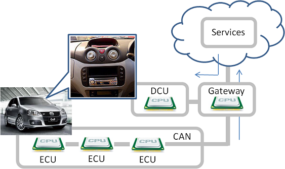
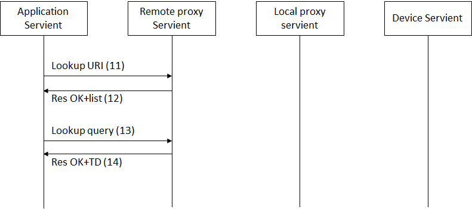
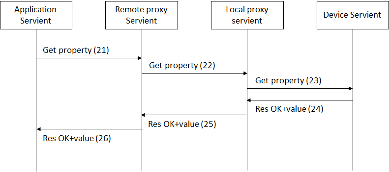
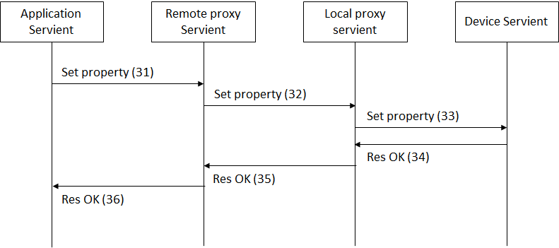
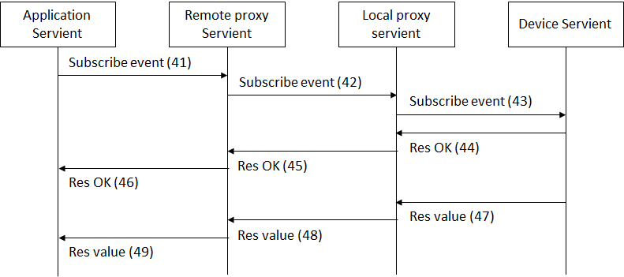

# PlugFest Preparation for Prague F2F 2018

# 1. Introduction

This document describes a general information related to the next plugfest in Prague F2F meeting. The detail specification will be descirbed in the guideline document, please see https://github.com/w3c/wot/blob/master/plugfest/2018-prague/guideline.md.

## 1.1 Backgroud

In the past plugfest, we've already checked consistency of the interfaces of two Servients provided by different members. They were combinations of application and device, or device to device. These application and devices were compatible to rWoT and talked with it. To setup a larger scale system, the gateawy functions are required to connect multiple applications and devices located on the different places. We'd introduced proxy Servients in the Burlingame plugfest to archieve this purpose. As a result of this, a variety of devices settled in some cases could be connected from the application running both on the cloud and on the local controlers. 
The figure below shows the diagram of all the Serviente connected to the network of the plugfest. 8 companies brought applications, remote proxies, local proxies and devices as WoT Serivients or protocol converters with legacy devicee, such as home appliances, building facilities, factory facilities and vihcles. 

## 1.2 Use case

Some use cases are described in below but not limited to the followings.

(1) Smart home
This is the smarthome application that the application on the smartphone can control the air conditioner in the house. The agent and the gateway have gateway functions that connects with applications, devices, and gateways.

(2) Smart factory

(3) Connected car

# 2. Servients

## 2.1 4-layered Servients

3 types of WoT Servients was derived from the use case described in 1.2. These are defined below:  
* Device Servient: WoT Servient with Exposed Thing, e.g. devices
* Application Servient: WoT Servient with Consumed Thing, e.g. applications
* Proxy Servient: WoT Servient with both Exposed and Consumed Thing, e.g. gateways

The Proxy Servient are seperated to 2 types fo them, Remote Proxy and Local Proxy. The Remote Proxy Servient is deployed on the Internet and connected with the Applicationd Serivent and the Local Proxy Servient. The Local Proxy Servient is done on the Local network and connects with the Remote Proxy Servient and the Device Servient. The layered diagram is shown below.

## 2.2 Servients and Protocols
Notes: The following contents has been just copied from Barlingame table. Please modify below directly or this powerpoint, https://github.com/w3c/wot/tree/master/plugfest/2018-prague/servients_prague.pptx

<table>
 <tr><th>Servients</th><th colspan=2>Fujitsu</th><th colspan=2>Panasonic</th><th>Internet Reserach Institute</th><th colspan=2>Siemens</th><th>Lemonbeat</th><th colspan=2>Intel</th><th colspan=2>SmartThings</th><th>EURECOM</th><th></th></tr>
 <tr><th>Application</th><th>Scripting App.</th><th>NodeRED</th><th>Scripting App.</th><th>NodeRED</th><th>NodeRED</th><th>Scripting App.</th><th>WebUI</th><th></th><th>AWS WoT Skill</th><th>AlexNet Recog Service</th><th>NodeRED Local</th><th>NodeRED Remote</th><th></th><th></th></tr>
 <tr><th>=protocol</th><th>HTTP</th><th>HTTP(s)</th><th colspan=2></th><th>HTTP(s)</th><th>HTTP, CoAP, BACnet, Modbus</th><th>HTTP, CoAP
</th><th></th><th colspan=2>HTTPS</th><th colspan=2>HTTP</th><th></th><th></th></tr>
 <tr><th>Remote Proxy</th><th colspan=2>Fujitsu Cloud</th><th colspan=2></th><th></th><th colspan=2>WoS Messaging Service</th><th></th><th colspan=2>Cloud proxy shadow</th><th colspan=2>Remote Gateway</th><th></th><th></th>
 <tr><th>=protocol</th><th colspan=2>HTTP(s)+WS</th><th colspan=2></th><th></th><th colspan=2>(tunnel)</th><th></th><th colspan=2>HTTPS/CoAP(s)</th><th colspan=2>Multi</th><th></th><th></th>
 <tr><th>Local Proxy</th><th>Local Gateway</th><th>Local Gateway</th><th colspan=2></th><th></th><th colspan=2>WoS Messaging Service, TD Registration Agent</th><th></th><th colspan=2>Local Proxy</th><th colspan=2>Local gateway</th><th></th><th></th></tr>
 <tr><th>=Protocol</th><th>HTTP</th><th>HTTP</th><th>HTTPS</th><th>HTTPS+WSS</th><th></th><th colspan=2>HTTP</th><th>HTTP</th><th colspan=2>CoAP</th><th colspan=2>Multi</th><th>HTTP</th><th></th></tr>
 <tr><th>Device</th><th>Sensors(Luminance sensor, Humidity sensor, Temperature sensor, Accelerometer), Rotating Light</th><th>Air conditioner, LED light, Blind</th><th>LED light, Air conditioner, Robot Cleaner</th><th>Human Detection Sensor, Amazon Echo, Google Home</th><th></th><th colspan=2>Remote Festo Plant (valve, pump, levelmeter), BACnet Demonstrator, Logo! Demonstrator, RGB LED Light</th><th>Sensors(Luminance sensor, Humidity sensor, Temperature sensor), Binary actuator</th><th colspan=2>OCF RGB light, OCF Light, OCF Buzzer, OCF temperture, OCF Button, OCF Proximity, OCF Slider, Still camera</th><th colspan=2>Dimmable Light(OCF), Motion Sensor(OCF), Dimmable Light(ST), Motion Sensor(ST), Gas Sensor(IPSO), PM2.5 Sensor(IPSO), Temperature Sensor(IPSO), Humidity Sensor(IPSO), Loudness Sensor(IPSO), Illuminance Sensor(IPSO), PIR Sensor(IPSO), Barometer Sensor(IPSO), OCF Bridge</th><th>Sensors and Actuators in the car(BMW X5)</th><th></th></tr>
</table>

## 2.3 Servients from plugfest participants ( diagram )

## 2.4 Details of Servients

### 2.4.1 Application Servients

Panasonic:
 - Scripting App.: Panasonic demo applications. (Local/Internet+LAN/HTTPS(+WSS))
 - NodeRED: would like to connect to the all servients. (Local/Internet+LAN/HTTPS(+WSS))

### 2.4.2 Remote Proxy Servients
### 2.4.3 Local Proxy Servients

Fujitsu:
 Remote/Local proxy Servients provide the following functions
 - Thing directory
 - Registry and discovery opeartions
 - Read and Write properties operations
 - Event operation
 
 See Appendix for the sequence diagrams and the interfaces between applications/devices and proxies.

### 2.4.4 Device Servients

Panasonic:
 - [LED light](TDs/PanasonicTDs/huegroup-p1.jsonld): on/off, RGB properties (Remote/Internet/HTTPS)
 - Air conditioner home: on/off, mode, temperature, wind level properties and events (Remote/Internet/HTTPS(+WSS))
 - Air conditioner car: on/off, number properties (Remote/Internet/HTTPS)
 - Robot Cleaner: on, turn left/right, go straight, go home, go area 1/2/3 actions (Remote/Internet/HTTPS)
 - Amazon Echo Dot: "home"/"bye" property and event (Local/Internet/HTTPS(+WSS))
 - Google Home mini: "home"/"bye" property and event (Local/Internet/HTTPS(+WSS))
 - Google Home mini: speech action (Local/LAN/HTTP)
 - WoT Simulator: can simulate the WoT devices easily. (Local/LAN/HTTP)

# 3 Plugfest scenarios

Examples of scenarii involving semantic querying:
- outlier detection: gather temperature data from different sources and compare them
- energy saving: turn heating off when a window opens in the same room
- meta-action: switch on a light either by changing its value or by invoking an action
- circle: all lamps in the same room sequentially switch off their nearest neighbor that is still on

# 4 Schedule

TBD

# 5 Requirements for PlugFest Setting

| Participant | Power           | Space            | Network | Display | Remarks |
|-------------|-----------------|------------------|---------|---------|---------|
| Panasonic   | 2 plugs, Type-C | 1 table, 3 seats | Wi-Fi(b/g/n), Ports: 22, 80, 443, 1880, 8001, 8003, 8091 | 1 | |
| Fujitsu     | 1 plug,  Type-C | 1 table, 4 seats | Wi-Fi | 1 | |
| IRI         | 1 plug,  Type-C | 1 table, 1 seat  | Wi-Fi | 1 | |
| Siemens     | 3 plugs, Type-C | 1 table, 2 seats | Wi-Fi | 1 | |
| Intel       | 1 plug,  Type-C | 1 table, 1 seat  | Wi-Fi | 1 | |
| SmartThings | 1 plug,  Type-C | 1 table, 1 seat  | Wi-Fi | 0 | |
| EURECOM     | 1 plug,  Type-C | 1 table, 2 seats | Wi-Fi | 0 | |
| Oracle      | 1 plug,  Type-C | 1 table, 1 seat  | Wi-Fi | 0 | |
| Hitachi     | 1 plug,  Type-C | 1 table, 1 seat  | Wi-Fi | 0 | |
| Others      | 1 plug,  Type-C | 1 table, 3 seats | Wi-Fi | 0 | |

# 6 Changes from previous PlugFest in Burlingame

## 6.1 TD changes

* link --> form
  form has "rel" field now also
* Property outputData --> Property schema
* Action inputData --> Action inputSchema
  Action outputData --> Action outputSchema
* Event outputData --> Event schema
* Type System changes
  fields --> field
  value --> schema
  
# Appendix A: Sequence diagrams specified in Fujitsu's proxy servients

Appendix A describes sequence diagram among application, remote / local proxies, and device servient implemented for this plugfest by Fujitsu.

This section shows sequence diagram and message formats exchange among servients which protocol is only HTTP to be used in this sequence. The remote and local proxies bridges with STUN for NAT traversal in this sequence.

### A1 Register
A device servient is registered to the local proxy servient and remote proxy servient. The proxy servient returned the TD with public URL. The proxy servients have TD repositories to store TDs registered from the other servients.

*Example: using HTTP*

(1) HTTP POST http://lps.example.com/Things/register 
Body: TD 
(2) 201 Created 

(3) (1) HTTP POST http://lps.example.com/Things/register 
Body: TD 

(4) 201 Created 

## A2 Lookup
An application servient can lookup TDs registered the remote proxy servient with its URL. If the URL indicates the servient, it returns the list of the devices connected. If the URL specifies the devices registered on the proxy servient, it returns TD of it.

*Example: using HTTP*

(11) HTTP GET http://rps.example.com/Things/ 
Body: none 

(12) 200 OK 
Body: list of registered things [FujitsuAirConditioner, PanasonicAirConditioner, …] 

(13) HTTP GET http://rps.example.com/Things/deviceName 
Body: none 

(14) 200 OK 
Body: TD

## A3 Read property
The application servient sends a request to read the value of the property of the device servient to the remote proxy servient. The remote and local proxy servient relay to this request to the device servient.

*Example: using HTTP*

The application gets a value of a certain property of the device servient. For this purpose, it gets the URL for the property from TD of the device servient.

(21) HTTP GET http://rps.example.com/lps1/Things/deviceName/Property/temperature 
Body: none 

The remote proxy gets the URL for the property from TD of the device servient registered in the repository. "glps.example.com" is global address which can be accessed from remote proxy.

(22) HTTP GET http://glps.example.com/Things/deviceName/Property/temperature 
Body: none 

The local proxy gets the URL for the property from TD of the device servient registered in the repository.

(23) HTTP GET http://192.169.1.2/Things/deviceName/Property/temperature 
Body: none 

(24) 200 OK 
Body: 25(value) 

(25) 200 OK 
Body: 25(value) 

(26) 200 OK 
Body: 25(value) 

## A4 Write property
The application servient sends a request to write the value to the property of the device servient to the remote proxy servient. The remote and local proxy servient relay to this request to the device servient.

*Example: using HTTP*

The application puts a value of a certain property of the device servient. For this purpose, it gets the URL for the property from TD of the device servient.

(31) HTTP PUT http://rps.example.com/lps1/Things/deviceName/Property/status 
Body: ON 

The remote proxy puts the URL for the property from TD of the device servient registered in the repository.
"glps.example.com" is global address which can be accessed from remote proxy.

(32) HTTP PUT http://glps.example.com/Things/deviceName/Property/status 
Body: ON 

## A5 Subscribe and Event
The application servient sends a request to subscribe the property of the device servient to the remote proxy servient. The device servient keep to send the value of the specified property periodically.

*Example: using HTTP*

The application subscribes an event of the device servient to be periodically notified. The application gets URL for this event and send a request to the remote proxy servient.

(41) HTTP POST http://rps.example.com/lps1/Things/deviceName/Event/change 
Body: none 

The remote proxy gets the URL for the event from TD of the device servient registered in the repository.

(42) HTTP POST http://glps.example.com/Things/deviceName/Event/change 
Body: none 

The local proxy gets the URL for this event from TD of the device servient registered in the repository.

(43) HTTP POST http://192.169.1.2/Things/deviceName/Event/change 
Body: none 

The device servient sends a notify to the application via the local and remote proxy servient with Server Sent Events specified by W3C.  The device responses “200 OK” with a header “Context-Type: text/event-stream”.

(44)-(46) 200 OK 
Context-Type:text/event-stream 
Body: none 

If this subscription succeeded, the events keep to be notified to the application via the local and remote proxy servients. This event is sent as chunk data.

(47)-(49)  
Body: data:25(value) 

## A6 Unsubscribe
The application servient sends a request to unsubscribe to the remote proxy servient to stop to notify the event from the device servient.

*Example: using HTTP*

The application unsubscribes the event “change. The application deletes URL for this event and send a request to the remote proxy servient.

(51) HTTP DELETE http://rps.example.com/lps1/Things/deviceName/Event/change 
Body: none 

The remote proxy gets the URL for the event from TD of the device servient unregistered in the repository.

(52) HTTP DELETE http://glps.example.com/Things/deviceName/Event/change 
Body: none 

The local proxy gets the URL for this event from TD of the device servient unregistered in the repository.

(53) HTTP DELETE http://192.169.1.2/Things/deviceName/Event/change 
Body: none 

The device servient stops sending event and returns the response with “200 OK”.

(54)-(56) 200 OK 
Body: none 

### A7 Unregister
The device servient unregister from the local proxy servient before shutdown. The local proxy servient unregister this device servient from the remote proxy not to access from the application.

*Example: using HTTP*

(61) HTTP DELETE http://lps.example.com/Things/deviceName 
Body: none 

(62) 200 OK 
       Body:none 

(63) HTTP POST http://rps.example.com/Things/deviceName 
Body: none 

(64) 200 OK 
Body:none 
