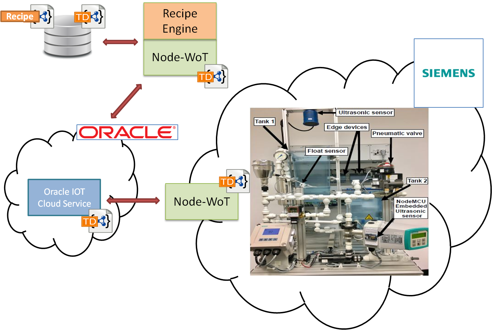
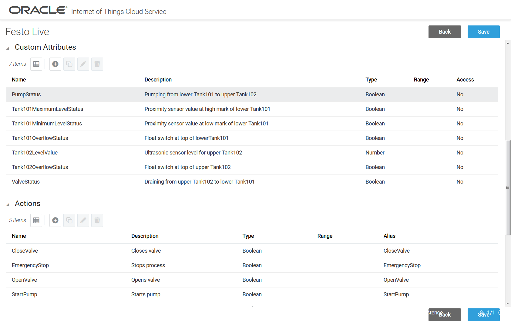

### 2.4.1 Application Servients: Overflow Protection in FESTO Plant

- Recipe is a semantic template that models mash-ups of WoT Things.
- [Overflow Protection Recipe](https://github.com/w3c/wot/blob/master/plugfest/2018-prague/semantic%20integration/Recipes/OverflowProtection.jsonld): If the overflow in the tank occurs, then drain the liquid out.Demo: Siemens-Oracle: FESTO plant accessed over Oracle Cloud

    
- Realization steps
	- Discover a Recipe for your application
		- using Thing Directory and iotschema.org
	- Discover Thing Descriptions to implement it
		- using Thing Directory and iotschema.org
	- Generate a script code
		- automated script generation based on Recipe
	- Implement application logic
		- implementing a simple script to detec when the ovrflow is detected
- Recipe Engine automates the first three tasks (above).

- Composition
	- [Festo Plant](https://github.com/w3c/wot/blob/master/plugfest/2018-prague/TDs/SiemensTDs/FestoLive.jsonld) (in Munich, proxied TD)
	- Accessible through Oracle IoT Cloud Service Server API
	- [node-wot](https://github.com/thingweb/node-wot)
	- [Thingweb Directory](http://plugfest.thingweb.io:8081/)
	- [iot.schema.org](http://iotschema.org/)
- PlugFest Result
	- FESTO devices exposed as Oracle IoT Cloud Service devices
	- FESTO devices, float sensor and pneumatic valve, connected with each other over Oracle IoT Cloud 
	- Discovery of Things with [iot.schema.org](http://iotschema.org/) 
	- Application script generation automated with Recipe Engine

### 2.4.2 Remote Proxy Servients

- Oracle IoT Cloud Service
   - Composition
      - Device Model and Application for live Festo Plant located in Munich
      - Accessible through Oracle IoT Cloud Service Server API
   - PlugFest Result
      - [Festo Live](https://github.com/w3c/wot/blob/master/plugfest/2018-prague/TDs/SiemensTDs/FestoLive.jsonld) Thing globally accessible
      - Proxied Property reads (fill level, overflow sensors, actuator status)
      - Proxied Action invocations (start/stop pump, open/close valve)

### 2.4.3 Local Proxy Servients

- [node-wot](https://github.com/thingweb/node-wot)
   - Composition
      - CoAP Binding to connect to local Festo Plant Things (NodeMCU-based)
      - [Oracle Binding](https://github.com/thingweb/node-wot/tree/master/packages/binding-oracle) to expose Things toward Oracle IoT Cloud Service
   - PlugFest Result
      - Consume CoAP-based Things (W3C WoT, described by TD)
      - Expose as Oracle IoT Cloud Service devices (Oracle product, own device model and protocol)

### 2.4.4 Device Servients

- [Festo Plant](https://github.com/w3c/wot/blob/master/plugfest/2018-prague/TDs/SiemensTDs/FestoLive.jsonld) (in Munich, proxied TD)
    - Composition
        - ESP8266-based devices
        - NodeMCU firmware with CoAP servers and self-hosted TDs
        - Lua scripting
    - PlugFest Result
        - Connected to node-wot local proxy
        - Remotely accessible via Oracle IoT Cloud Service
- [Raspberry Servient](https://github.com/w3c/wot/blob/master/plugfest/2018-prague/TDs/SiemensTDs/Unicorn.jsonld)
    - Composition
        - Raspberry Pi with Unicorn HAT RGB LED shield
        - [node-wot Servient](https://github.com/thingweb/node-wot/blob/master/packages/demo-servients/src/raspberry-servient.ts)
    - PlugFest Result
        - Accessible locally
        - Registered to Fujitsu proxy
        - Connected with ...(please help)...
- [Event Source](https://github.com/w3c/wot/blob/master/plugfest/2018-prague/TDs/SiemensTDs/EventSource.jsonld)
    - Composition
        - [Script](https://github.com/thingweb/node-wot/blob/master/examples/scripts/example-event.js) running in node-wot Servient on Laptop
    - PlugFest Result
        - Registered to Fujitsu proxy
        - Connected with ...(please help)...
- [WittyCloud](https://github.com/w3c/wot/blob/master/plugfest/2018-prague/TDs/SiemensTDs/WittyCloud.jsonld)
    - Composition
        - ESP8266-based "Witty Cloud" device with brightness sensor and RGB LED
        - NodeMCU firmware with CoAP server and self-hosted TD
    - PlugFest Result
        - Updated to latest TD draft
