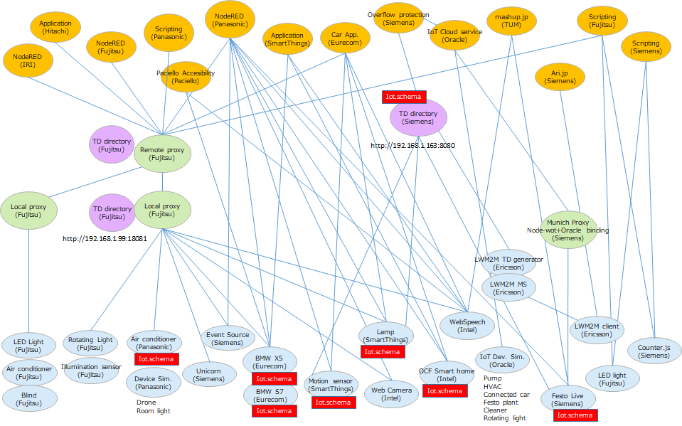
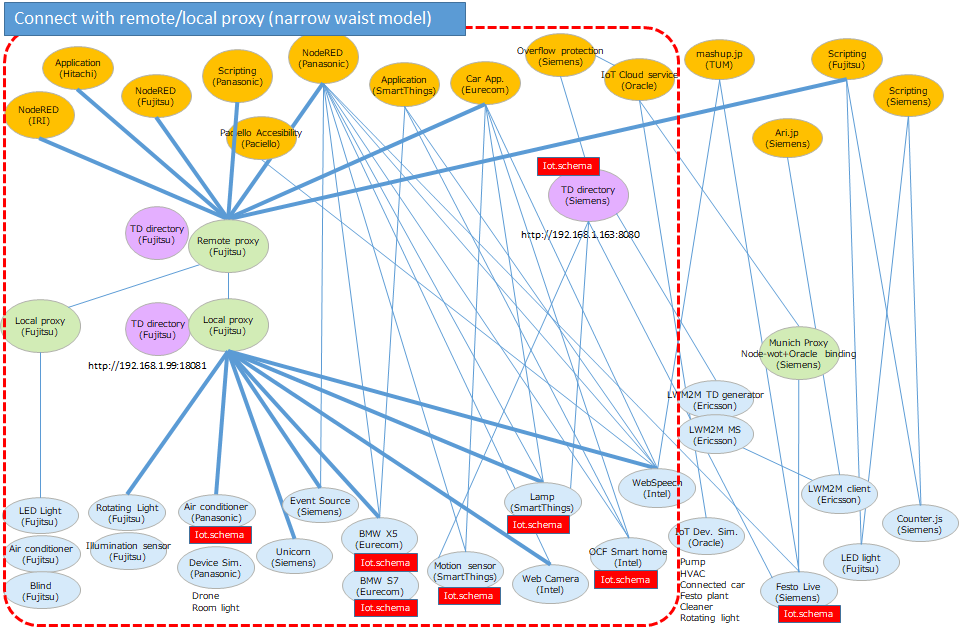
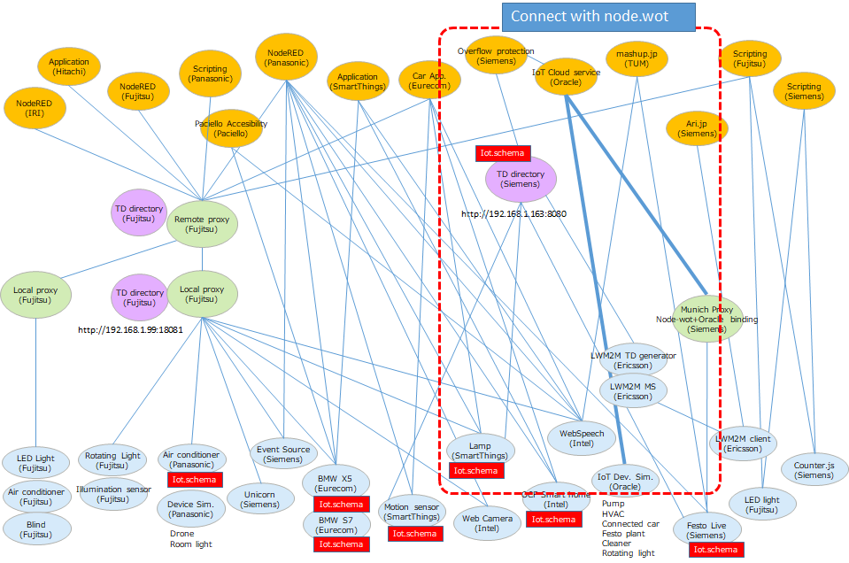
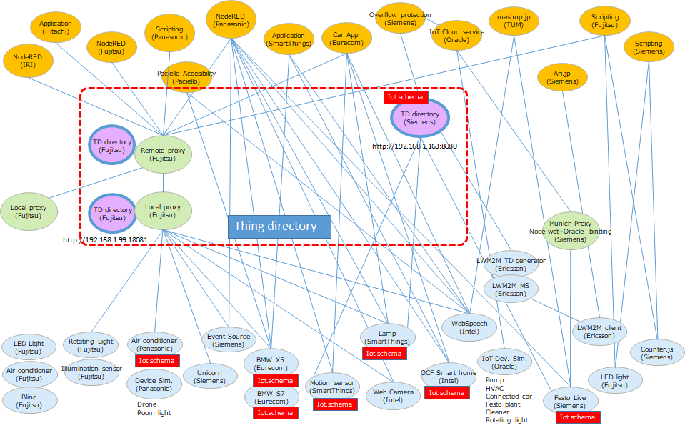
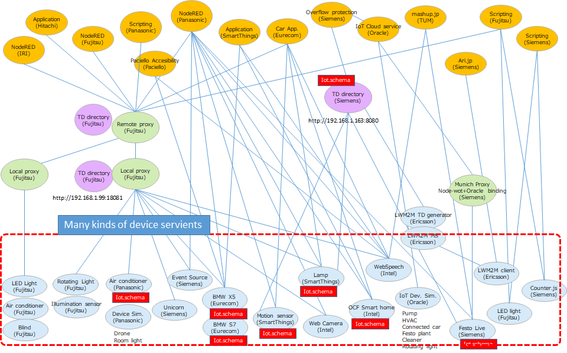
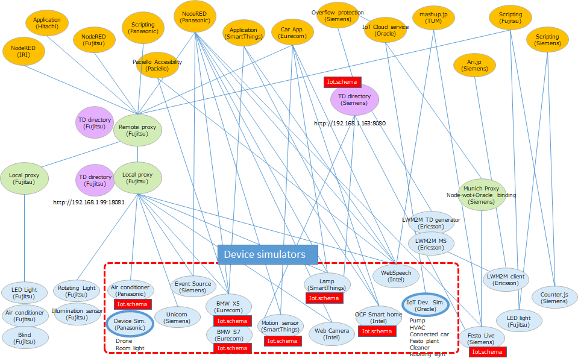
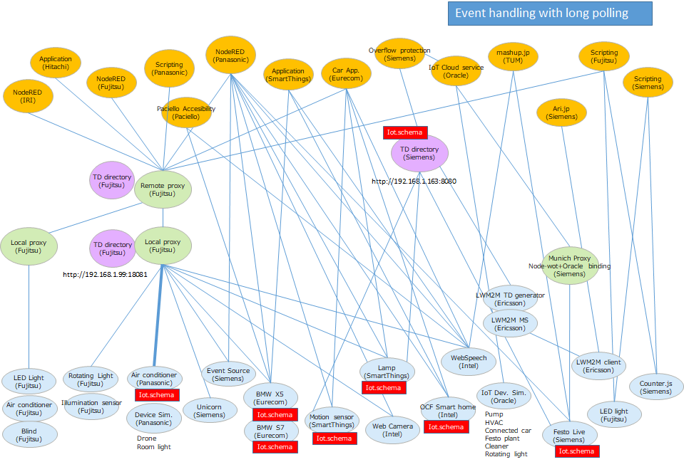

# Plugfest result in Prague

# 1. Introduction

This document describes the result of WoT plugfest held in Prague on 24-5 of March, 2018.

## 1.1 Participants

Oracle, Ericsson, EURECOM, Fujitsu, Hitachi, Intel, Internet Research Institute, The Paciello Group, Panasonic, SmartThings/Samsung Research, Siemens, Technical University of Munich(TUM)

## 1.2 WoT Servients

The drawing below is the ocnfiguration for the Prague plugfest.

# 2. Evaluation on checking points in Prague plugfest

## 2.1 Connect with remote/local proxy (narrow waist model)

### SmartThings
   (future work)

## 2.2 Application servient

### SmartThings
  Application servient used Node-RED and ad-hoc flows

## 2.3 Connect with node-wot

### SmartThings
   (future work)

## 2.4 Scripting API

### SmartThings
   (future work))

## 2.5 Thing Directory

### SmartThings
   We used the provided Thing Directory to register exposed things
   Implemented a node-RED flow to allow a short registration lifetime
   with periodic refresh messages to keep-alive

## 2.6 Many kinds of device servients

### SmartThings
   LAN connected Devices
   Philips Hue light bulb exposed through a simple REST api
   Arduino-based motion sensor exposed using Node-RED and a raspberry pi

## 2.7 Device simulators

### SmartThings
   (future work)

## 2.8 Semantic discovery

### SmartThings
   Used Thing Directory queries to retrieve Thing Descriptions with desired semantic capabilities.

## 2.9 Security

### SmartThings
   (future work)

## 2.10 Accessibility

### SmartThings
   (future work)

## 2.11 Event handling with long polling

### SmartThings
   (future work))

# 3. Issues for the next plugfest

## 3.1 followings should be improved for next:
- Use servients for applications and things
- Use wot proxy for LAN-WAN operation
- Use SSE,longpoll, or websockets on LAN for real time updates

## 3.2 Thing directory will be specified more detail
- Semantic annotation and query

## 3.3 Web browser as a WoT Servient will be connected
- (future work)

## 3.4 Collecting TD and servient information should be needed
- TDs to be uploaded to WoT repository

## 3.5 Network topology variations
- Collect use cases of network topology.

## 3.6 Interface between servients
- Specify interface and sequence diagram

## 3.7 Meta applications

- Operated the Intel Light
- Operated the Eurecom Auto seat heater Control
- Exposed light for control by others
- Exposed Motion Sensor for use by others
