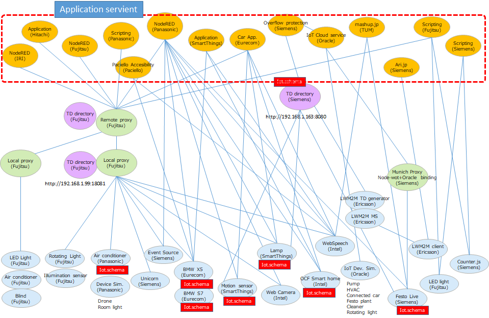
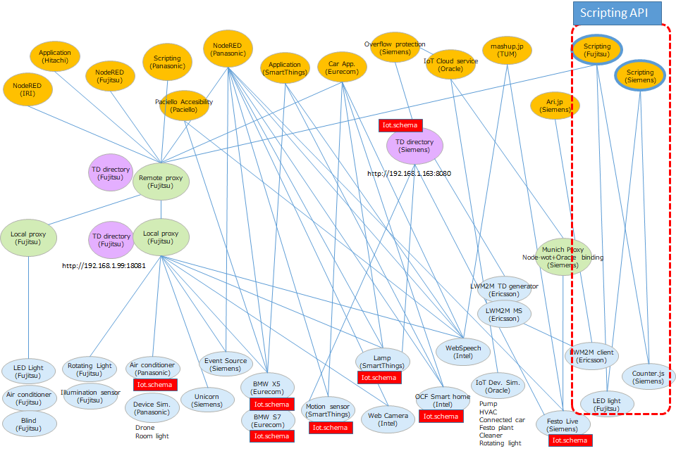
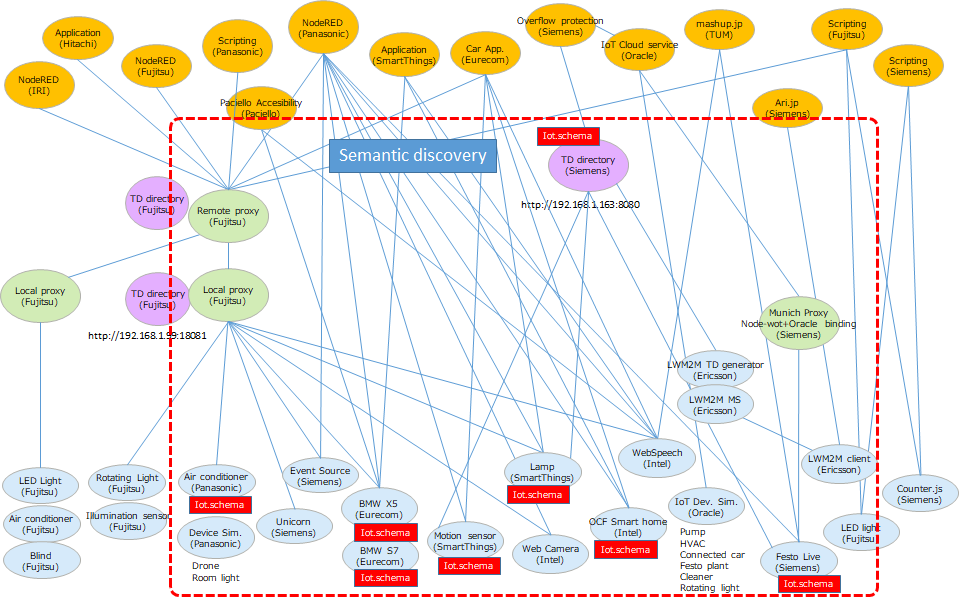
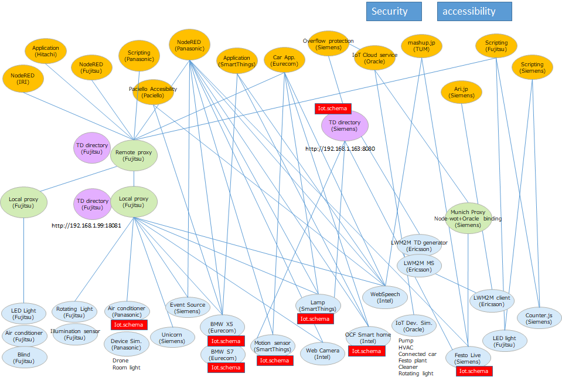

# Plugfest result in Prague

# 1. Introduction

This document describes the result of WoT plugfest held in Prague on 24-5 of March, 2018.

## 1.1 Participants

Oracle, Ericsson, EURECOM, Fujitsu, Hitachi, Intel, Internet Research Institute, The Paciello Group, Panasonic, SmartThings/Samsung Research, Siemens, Technical University of Munich(TUM)

## 1.2 WoT Servients

The drawing below is the ocnfiguration for the Prague plugfest.

# 2. Evaluation on checking points in Prague plugfest

## 2.1 Connect with remote/local proxy (narrow waist model)

### Fujitsu
   We provide remote/local proxy and our application(node-red) and devices connect them.

### Hitachi
   It is useful for application developer (on the Internet) to aggregate all local device servient access.

### Panasonic
   Both Application Servients and Device Servients are successfully connected to Fujitsu remote/local proxy.

## 2.2 Application servient

### Fujitsu
   We use Node-RED to lookup TD and set/get property value and Action.
   Nimura-san use scripting api.

### Hitachi
   Our Servients are example of "minimal Servient implementations", which is mentioned in [the Architecture document](https://w3c.github.io/wot-architecture/#application).  We can easily connect to WoT device using IoT tools that support HTTP REST API call.
   It might be a good idea to check connectivity of other existing IoT tools for broader adoption of WoT.
   And also, it may be better to mention legacy *applications* (i.e. existing, commonly-used IoT tools) connectivity in the Architecture document, same as legacy *devices*.

### Panasonic
   Supported both Scripting App and NodeRED
   Future work: cross domain scenario (home, mobility, social infrastructure, etc) with meaningful scenario.

## 2.3 Connect with node-wot

### Fujitsu
   (future work)

### Hitachi
   (future work)

### Panasonic
   (future work)

## 2.4 Scripting API

### Fujitsu
   (Nimura-san will insert here)

### Hitachi 
   (future work)

### Panasonic
   Support Consumed Thing in JavaScript scripting API.
   (Exposed Thing not supported)

## 2.5 Thing Directory 

### Fujitsu
   We provide simple one. Application Servients can lookup TDs by specifying the device's name.

### Hitachi
   We just crawl all TDs in Fujitsu's directory.  Using search functions from application servient is future work.

### Panasonic
   Did not provide directory by ourselves.
   Registered and retrieved TDs to/from Fujitsu's directory through a tool (Advanced REST Client and POSTMAN).
   Future work: Automatic registration when starting WoT Server; Integrated retrieval from WoT Client.

## 2.6 Many kinds of device servients

### Fujitsu
   Local Devices: Rotary Beacon Light(connectet by EtherCAT) and Brightness Sensor(connectet by BLE)
   Remote Devices(in Japan): LED Light, Blind and Airconditioner (connected by Echonet LITE)

### Hitachi
   Our application only collect properties on each devices.  Not yet utilized each characteristic of device.
   Utilizing them based on semantic annotations is future work.

### Panasonic
   Several Local and Remote Device Servients are provided (See 2.4.4)

## 2.7 Semantic discovery

### Fujitsu
   (future work)

### Hitachi
   (future work)

### Panasonic
   Some TDs support semantic annotation.
   Future work: Application using semantic discovery with meaningful scenario.

## 2.8 Security, Accessibility

### Fujitsu
   We use bearer token for access the remote/local proxy.

### Hitachi
   We used bearer token for access the remote proxy.  The token is received by a mail and is included in configuration file by hand.  These process is needed to improve using more sophisticated manner (e.g. OAuth etc.)

### Panasonic
   HTTPS and bearer token are supported
   Future work: Authentication

## 2.9 Event handling with long polling

### Fujitsu
   Brightness Sensor support long polling

### Hitachi
   (future work)

### Panasonic
   Supported by some Device Servients (Air-conditioner and Lighting on Simulator)

## 2.10 Device simulators

### Fujitsu
   (future work)

### Hitachi
   (future work)

### Panasonic
   Device Simulator works on Raspberry-Pi, PC and cloud.

# 3. Issues for the next plugfest

## 3.1 followings should be improved for next:
- Use the same schema between members
- Security
- Accessibility

## 3.2 Thing directory will be specified more detail
- Two different interfaces provided by Siemens and Fujitsu
- Directory interface should be specified
- Roles of directory and proxy should be specified in Fujitsu proxy
## 3.3 Web browser as a WoT Servient will be connected
- Fujitsu and Panasonic implemented 

## 3.4 Collecting TD and servient information should be needed
- Please upload your TDs to github and give some explanation of your servients.

## 3.5 Network topology variations
- Collect use cases of network topology.

## 3.6 Interface between servients
- Specify interface and sequence diagram
- Describe these in appendix of Architecture document.

## 3.7 Meta applications

## 3.8 CORS issue when using Scripting app on browser. (inserted by Panasonic)
- To be accessed by browser through XMLHTTPRequest, WoT Servients need to add "Access-Control-Allow-Origin: * " header in it's response to the requests including OPTIONS method.

## 3.9 Multiple "form" issue when using Fujitsu proxy (inserted by Panasonic)
- Fujitsu proxy currently does not support multiple "form" for one property.
- In Panasonic TD, "read/write" and "observe" to a same property is expressed as two different HTTP endpoints
  ->changes to two different property were necessary.

    
