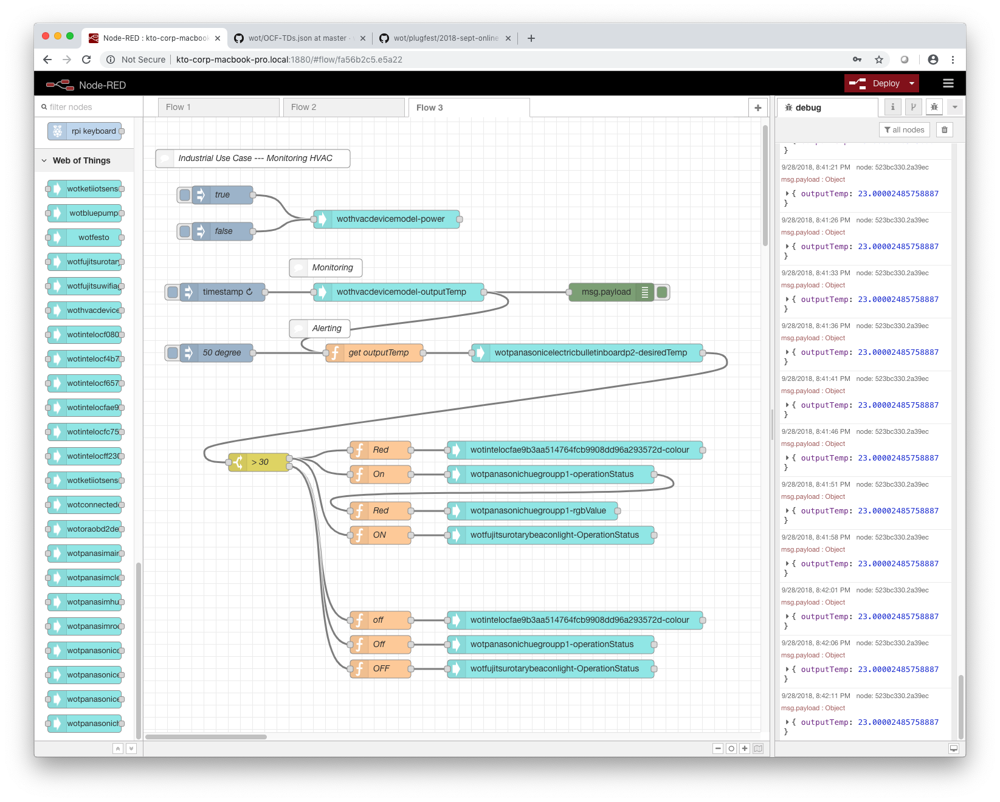

# Hitachi PlugFest Result for Online September 2018

This document summerizes the results of the Online September PlugFest held Sep 25-27.

## 3 Checking points for Online September 2018 PlugFest

Result of Hitachi projects

Above image is generated from [this source code](images/servients.gv) by 
[Graphviz](https://www.graphviz.org/).
[This](images/HFP_PlugfestSummary181010.svg) is merged 
(Hitachi/Fujitsu/Panasonic) version.

### 3.1 Testing Individually
#### 3.1.1 Validate Simplified TDs

* NA

#### 3.1.2 Register with Thing Directory

* NA

#### 3.1.3 Connect with Remote/Local Proxy

* NA

#### 3.1.4 Connect with node-wot

* NA

#### 3.1.5 Scripting API

* NA

### 3.2 Testing in Client Role
#### 3.2.1 Metadata Handling

* OK
   * Issue: NA
   * Comment: Node-generator has successfully incorporated property names etc. in TD to configuration interfaces.

#### 3.2.2 Read Property

##### HTTP

* OK

##### CoAP

* NA

##### MQTT

* NA

##### Other 

* NA

#### 3.2.3 Write Property

##### HTTP

* OK

##### CoAP

* NA

##### MQTT

* NA

##### Other

* NA

#### 3.2.4 Observe Property

##### HTTP+Longpoll

* OK

##### HTTP+Webhooks

* NA

##### CoAP

* NA

##### WebSockets

* NA

##### MQTT

* NA

##### Other

* NA

#### 3.2.5 Invoke Action

##### HTTP

* OK
 
##### CoAP

* NA

##### MQTT

* NA

##### Other

* NA

#### 3.2.6 Subscribe Event

##### HTTP+Longpoll
 
* OK

##### HTTP+Webhooks

* NA

##### CoAP

* NA

##### WebSockets

* NA

##### MQTT

* NA

##### Other

* NA

#### 3.2.7 Security

##### Basic Authentication

* OK

##### Bearer Token

* OK

##### Digest Authentication

* NA
   * Implemented, but not tested.

##### OAuth2

* NA

#### 3.2.8 Semantic integration

* NA

#### 3.2.9 Accessibility

* NA

### 3.3 Testing in Server Role

* NA

### 3.4 Other issues

#### 3.4.1 Producing Running Actions and Event Instances

* NA

#### 3.4.2 Consuming Running Actions and Event Instances

* NA

#### 3.4.3 New Security Patterns

* NA

#### 3.4.4 Miscellaneous

## 4 Use cases

### Industrial Usecase: Remote Monitoring/Alerting

- VOC(volatile organic compound) Remote Monitoring 
  - Observing VOC value on KETI Environment IoT sensor, and
    displaying at Panasonic's Bulletinboard.

- Pump Remote Monitoring
  - Reading Cycle Peak Operation(%) on Blue Pump (Oracle simulator),
    and displaying at Panasonic's Bulletinboard.
    And showing alert on Panasonic's HueGroup.

- Monitoring HVAC
  - Reading periodicaly Temperature value of Oracle's HVAC simulator, and displaying the value at Panasonic's Bulletinboard.
  - When temperature value exceeds threashold value (> 30 degree), alert signals will be sent to remote sites.
    - Panasonic's Hue Groups turns red.
    - Intel's LED turns red.
    - Fujitsu's Rotary Beacon Light flashes.

